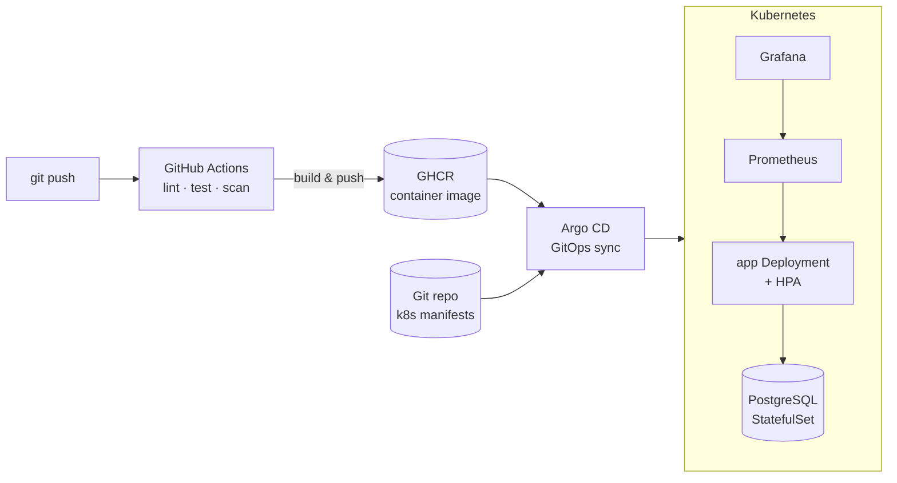
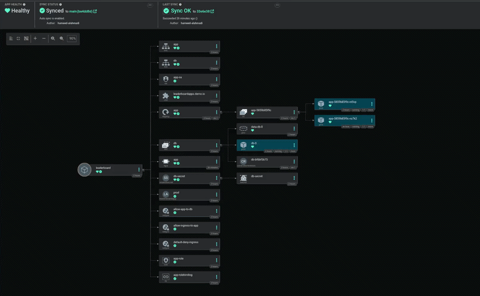
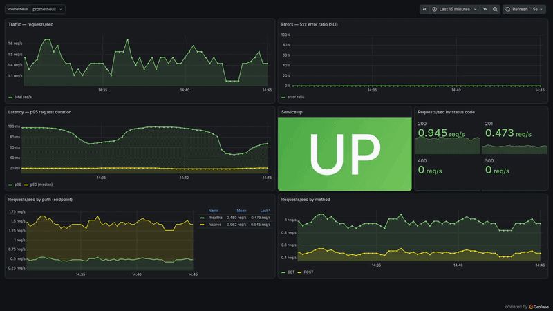
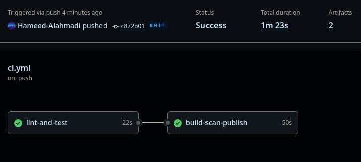

# Leaderboard API — End-to-End DevOps Project


A small **REST leaderboard service** (Flask + PostgreSQL) used as the vehicle for a **complete, production-style DevOps pipeline** — from a single container all the way to GitOps-driven Kubernetes with autoscaling, security hardening, monitoring, and disaster recovery.

The application itself is intentionally simple. **The point of this repository is the delivery chain around it.**

---

## Architecture



**Flow:** every `git push` runs the CI pipeline (lint, test, vulnerability scan), publishes an image to GHCR, and **Argo CD** reconciles the cluster to match Git — no manual `kubectl apply`.

---

## Screenshots

**Argo CD — the full application tree, synced from Git**

Every resource reconciled from `k8s/`: the Deployment and its live pods, the PostgreSQL StatefulSet with its PVC, Services, HPA, SealedSecret, NetworkPolicies, RBAC, and a custom CRD — all `Healthy` and `Synced`.



**Grafana — live service metrics**

Traffic, p50/p95 latency, error-rate SLI, and request breakdowns by status code, endpoint, and method.



**CI/CD — every push is tested before it ships**

`build-scan-publish` only runs once `lint-and-test` passes, so an image never reaches the registry unless the tests and the vulnerability scan are green.



---

## Tech stack

| Layer | Tools |
|---|---|
| **App** | Python 3.12, Flask, Gunicorn, PostgreSQL (psycopg 3) |
| **Container** | Docker (non-root image), Docker Compose |
| **CI/CD** | GitHub Actions, pytest, ruff, Trivy (image scanning), GHCR |
| **Orchestration** | Kubernetes, Deployments, StatefulSet, Services, HPA |
| **Packaging** | Helm (one chart, per-environment values) |
| **GitOps** | Argo CD (app-per-environment) |
| **Security** | RBAC, NetworkPolicy, securityContext, Sealed Secrets |
| **Observability** | Prometheus, Grafana, prometheus-flask-exporter, SLO alerts |
| **Reliability** | Rolling updates, etcd snapshots (DR drill) |

---

## The API

| Method | Path | Description |
|---|---|---|
| `GET` | `/healthz` | Liveness + DB reachability check |
| `GET` | `/scores` | Top scores, ranked |
| `POST` | `/scores` | Add a score (`{"player": "...", "score": 90}`) |
| `GET` | `/metrics` | Prometheus metrics |

---

## Run it locally

Requires Docker.

```bash
# app + database
docker compose up --build          # → http://localhost:8000

# add a few scores
curl -X POST http://localhost:8000/scores \
  -H 'Content-Type: application/json' -d '{"player":"michael","score":90}'
curl -X POST http://localhost:8000/scores \
  -H 'Content-Type: application/json' -d '{"player":"jessica","score":75}'
curl -X POST http://localhost:8000/scores \
  -H 'Content-Type: application/json' -d '{"player":"david","score":88}'

# read the ranked leaderboard
curl http://localhost:8000/scores
```

Full observability stack (app + Prometheus + Grafana):

```bash
docker compose -f compose.obs.yaml up -d
# Prometheus → http://localhost:9090   ·   Grafana → http://localhost:3000
```

---

## CI/CD pipeline

Defined in [`.github/workflows/ci.yml`](.github/workflows/ci.yml). On every push / PR to `main`:

1. **Lint & test** — `ruff` + `pytest` against a throwaway PostgreSQL service.
2. **Build, scan, publish** — build the image, scan it with **Trivy** (CRITICAL/HIGH), and push to **GHCR** on `main`.

The image is published to `ghcr.io/hameed-alahmadi/leaderboard-platform`.

---

## Kubernetes & GitOps

Raw manifests live in [`k8s/`](k8s/); the Helm chart lives in [`chart/`](chart/).

```bash
# deploy the raw manifests
kubectl apply -f k8s/

# or deploy dev & prod from one Helm chart
helm install leaderboard ./chart -f chart/values-dev.yaml  -n dev  --create-namespace
helm install leaderboard ./chart -f chart/values-prod.yaml -n prod --create-namespace
```

**GitOps with Argo CD** — [`application.yaml`](application.yaml) points Argo at `k8s/` and auto-syncs on every push. [`argo-dev.yaml`](argo-dev.yaml) / [`argo-prod.yaml`](argo-prod.yaml) run the Helm chart as one **Application per environment**.

---

## Production practices demonstrated

- **Autoscaling** — Horizontal Pod Autoscaler on CPU ([`k8s/hpa.yaml`](k8s/hpa.yaml)); the HPA owns the replica count, kept out of Git to avoid drift.
- **Zero-downtime deploys** — rolling update with `maxUnavailable: 0`, gated by a readiness probe.
- **Security (defense in depth)** — least-privilege **RBAC**, default-deny **NetworkPolicy**, non-root **securityContext**, and **Sealed Secrets** so encrypted secrets are safe to commit.
- **Observability** — Prometheus scrapes app metrics; an **SLO-based alert** ([`alerts.yml`](alerts.yml)) fires on user-visible error rate, not raw CPU.
- **Disaster recovery** — a real **etcd snapshot** drill (cluster state backup).
- **Platform extension** — a custom **CRD** ([`k8s/crd.yaml`](k8s/crd.yaml)) showing how the Kubernetes API is extended by Operators.

---

## Repository layout

```text
leaderboard-app/
├── app.py                     # Flask API
├── dockerfile                 # non-root container image
├── docker-compose.yml         # local app + db
├── compose.obs.yaml           # app + db + Prometheus + Grafana
├── prometheus.yml · alerts.yml
├── tests/                     # pytest suite
├── .github/workflows/ci.yml   # CI/CD pipeline
├── k8s/                       # Kubernetes manifests (app, db, hpa, rbac, netpol, secrets, crd)
├── chart/                     # Helm chart + per-env values
└── application.yaml · argo-dev.yaml · argo-prod.yaml   # Argo CD (GitOps)
```

---

## Engineering challenges solved

Real problems hit and fixed while building this — the kind of thing that matters more than the happy path:

- **Argo CD `OutOfSync` loop** — the HPA constantly rewrote `spec.replicas` while Git tried to pin it. Fixed by letting the HPA own the count (kept out of Git) and setting the floor via `minReplicas`.
- **`runAsNonRoot` blocked the pod** — the image ran as root and Kubernetes couldn't verify a *named* user. Fixed by baking a **numeric** non-root user (`USER 1000`) into the image.
- **Sealed Secrets after cluster recreation** — reinstalled the controller and re-sealed with the correct controller name/namespace.
- **HPA showing `<unknown>` CPU** — added CPU **requests** and installed **metrics-server** (with the kind TLS patch).
- **etcd backup on kind** — `etcdctl` lives inside the etcd pod, not the node; ran it via `kubectl exec` and wrote the snapshot to the node-mounted data dir to copy it out.

---

## Roadmap

- Deploy to a managed cluster (EKS/GKE) behind a real domain + TLS
- Progressive delivery with **Argo Rollouts** (canary / blue-green)
- Centralized logging (Loki) alongside metrics
